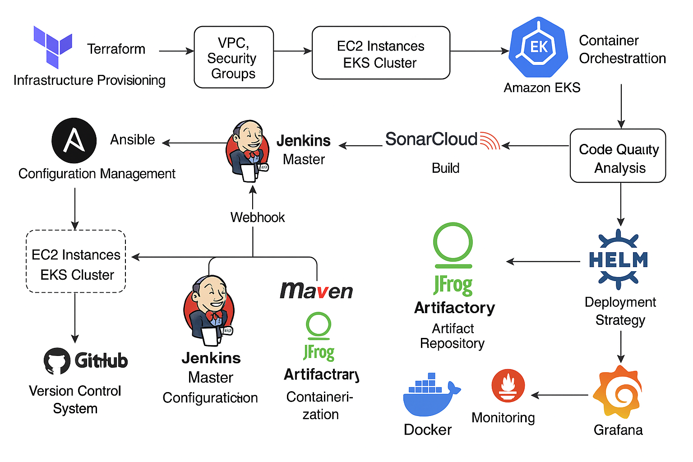

# Project Overview

This project aims to establish a comprehensive Continuous Integration and Continuous Deployment (CI/CD) pipeline. The pipeline automates the entire process from infrastructure provisioning and configuration management to code building, testing, analysis, artifact storage, containerization, deployment to a Kubernetes cluster, and monitoring. It leverages various industry-standard tools like Terraform, Ansible, Jenkins, GitHub, SonarCloud, JFrog Artifactory, Docker, AWS EKS, and Prometheus/Grafana to achieve a fully automated software delivery lifecycle.

# Requirements

Based on the steps outlined, the project requires the following components and tools:

* **Cloud Provider:** AWS (for VPC, EC2, EKS).
* **Infrastructure as Code (IaC):** Terraform.
* **Configuration Management:** Ansible.
* **CI/CD Server:** Jenkins (Master and Agent nodes).
* **Version Control System:** GitHub.
* **Code Quality Analysis:** SonarCloud/SonarQube (including scanner plugin and server integration).
* **Artifact Repository:** JFrog Artifactory.
* **Containerization:** Docker.
* **Container Orchestration:** Amazon EKS (Elastic Kubernetes Service).
* **Kubernetes CLI:** kubectl.
* **AWS CLI:** AWS CLI v2.
* **Package Manager for Kubernetes:** Helm.
* **Monitoring:** Prometheus and Grafana.
* **Secure Communication:** SSH key pairs.

# Design

The project follows a modern DevOps approach with the following design principles:

* **Infrastructure Automation:** Terraform provisions the core infrastructure on AWS, including VPC, security groups, and EC2 instances for Ansible and Jenkins. It also provisions the EKS cluster.
* **Configuration Automation:** Ansible configures the Jenkins Master and Agent nodes, including setting up passwordless SSH between the Ansible controller and agents.
* **CI/CD Orchestration:** Jenkins acts as the central orchestrator. A Multibranch Pipeline job is configured to automatically detect branches/pull requests in a GitHub repository. GitHub webhooks trigger Jenkins builds upon code changes.
* **Pipeline Stages:** The Jenkins pipeline includes stages for checking out code, building the application (e.g., using Maven), running unit tests, performing code analysis with SonarCloud, building a Docker image, publishing artifacts (JARs, Docker images) to JFrog Artifactory, and deploying the application to the EKS cluster.
* **Artifact Management:** JFrog Artifactory stores build artifacts (like JAR files) and Docker images.
* **Deployment Strategy:** The application is containerized using Docker and deployed to the AWS EKS cluster using Kubernetes deployment and service resources. Jenkins interacts with EKS using kubectl and AWS CLI.
* **Monitoring:** Prometheus collects metrics from the EKS cluster, and Grafana provides visualization dashboards for monitoring cluster health and application performance. Helm is used to deploy Prometheus and Grafana.

# Plan

The project execution follows a logical sequence outlined by the steps in the steps.md file:

1.  Provision Base Infrastructure: Use Terraform to create VPC, Security Groups, Ansible Controller, Jenkins Master, and Jenkins Agent instances.
2.  Configure Ansible Access: Set up passwordless SSH between the Ansible Controller and Agent nodes.
3.  Configure Jenkins: Use Ansible to install and configure Jenkins Master and Agent nodes. Set up an agent as a Maven build server.
4.  Connect Jenkins Nodes: Add Jenkins Agent credentials to the Jenkins Master.
5.  Integrate GitHub: Add GitHub credentials to Jenkins and create a Multibranch Pipeline job linked to the GitHub repository.
6.  Enable Webhook Triggers: Configure GitHub webhooks and the Jenkins Multibranch Scan Webhook Trigger plugin for automatic builds.
7.  Integrate SonarCloud: Generate a SonarCloud token, add credentials to Jenkins, install the SonarQube Scanner plugin, configure the SonarQube server and scanner tool in Jenkins, set up the SonarCloud project, create sonar-project.properties, and add analysis/test stages to the Jenkinsfile.
8.  Integrate Artifactory: Add JFrog Artifactory credentials to Jenkins, install the Artifactory plugin, and configure the Artifactory server in Jenkins.
9.  Dockerize and Publish: Add a stage to the Jenkinsfile to build a Docker image from the application JAR and push it to the Artifactory Docker repository.
10. Provision EKS Cluster: Use Terraform to provision the EKS cluster. Install kubectl and AWS CLI v2 on the Jenkins Agent. Download cluster credentials.
11. Deploy to EKS: Add a Jenkinsfile stage to pull the Docker image from Artifactory and deploy it to EKS using Kubernetes deployment and service manifests. Create necessary Kubernetes secrets for Artifactory access.
12. Implement Monitoring: Add the Prometheus Helm repository, install Prometheus and Grafana using Helm charts, and configure them for cluster monitoring.

# Implementation Summary

Here's a summary of the implementation details based on the steps:

## Step 1 (Terraform Infrastructure)

* Define VPC, Security Groups, EC2 instances (Ansible Controller, Jenkins Master, Jenkins Agents) in Terraform configuration files (`.tf`).
* Apply the configuration using `terraform apply`.

## Step 2 (Ansible SSH Setup)

* Generate SSH keys on the Ansible controller.
* Use `ssh-copy-id` to distribute the public key to agent nodes for passwordless login.
* Update the Ansible inventory file (`hosts`).

## Step 3 (Ansible Jenkins Setup)

* Create Ansible playbooks (`.yml`) to install Java and Jenkins on the master, and Java and the agent JAR on agents.
* Configure agents as systemd services.
* Run playbooks using `ansible-playbook`.
* Configure the Maven build agent within Jenkins UI.

## Step 4 (Jenkins Credentials)

* Add SSH credentials (or secret text) for agent nodes within Jenkins Master's "Manage Credentials" section.
* Configure the agent node in Jenkins to use these credentials.

## Step 5 (GitHub Integration)

* Generate a GitHub Personal Access Token (PAT).
* Add the PAT as "Username with password" credentials in Jenkins (using the PAT as the password).
* Create a "Multibranch Pipeline" job in Jenkins.
* Configure the GitHub source using the repository URL and the created credentials.
* Define the pipeline logic in a `Jenkinsfile` within the repository.

## Step 6 (Webhook Trigger)

* Install the "Multibranch Scan Webhook Trigger" plugin in Jenkins.
* Configure a webhook in the GitHub repository pointing to `your-jenkins-domain/github-webhook/`.
* Enable webhook triggering options in the Multibranch Pipeline job configuration.

## Step 7 (SonarCloud Integration)

* Generate a token in SonarCloud.
* Add the token as "Secret text" credentials in Jenkins.
* Install the "SonarQube Scanner" plugin in Jenkins.
* Configure the SonarQube server connection in "Manage Jenkins" -> "Configure System".
* Configure the scanner tool in "Manage Jenkins" -> "Global Tool Configuration".
* Create an organization/project in SonarCloud.
* Add a `sonar-project.properties` file to the repository with project configuration.
* Add build, unit test, and SonarQube analysis stages (using `withSonarQubeEnv`) to the `Jenkinsfile`.

## Step 8 (Artifactory Integration)

* Add Artifactory API Key/Token as "Secret text" credentials in Jenkins.
* Install the "JFrog Artifactory" plugin in Jenkins.
* Configure the Artifactory server connection in "Manage Jenkins" -> "Configure System".

## Step 9 (Docker Build & Push)

* Use the Docker Pipeline plugin syntax (`docker.build`, `docker.withRegistry`) within the `Jenkinsfile`.
* Build the Docker image from the application JAR.
* Push the built image to the configured Artifactory Docker registry.
* Requires a `Dockerfile` in the repository.

## Step 10 (EKS Provisioning & Setup)

* Use the Terraform AWS EKS module to define and provision the cluster.
* Install `kubectl` and `AWS CLI v2` on the Jenkins agent (either via pipeline steps or by building them into the agent image).
* Use AWS CLI/kubectl commands (`aws eks update-kubeconfig`) within the Jenkinsfile to configure kubeconfig for cluster access.

## Step 11 (EKS Deployment)

* Create a Kubernetes secret (`kubectl create secret docker-registry`) for Artifactory credentials within the EKS cluster.
* Define Kubernetes Deployment and Service YAML manifests (`deployment.yaml`, `service.yaml`), referencing the image in Artifactory and the image pull secret.
* Add a Jenkinsfile stage using `kubectl apply -f` to deploy the manifests to EKS.

## Step 12 (Monitoring Setup)

* Install Helm on the Jenkins agent or a dedicated machine.
* Add the prometheus-community Helm repository (`helm repo add prometheus-community https://prometheus-community.github.io/helm-charts`).
* Use `helm install` to deploy Prometheus and Grafana charts (`helm install prometheus prometheus-community/prometheus`, `helm install grafana prometheus-community/grafana`).
* Potentially customize the deployment with a `values.yaml` file.
* Configure Prometheus as a data source in Grafana.
* Import or create monitoring dashboards in Grafana.
* Access Grafana via port-forwarding or a service configured for external access (e.g., Load Balancer).